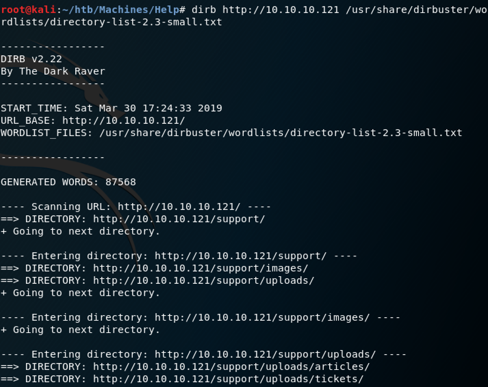
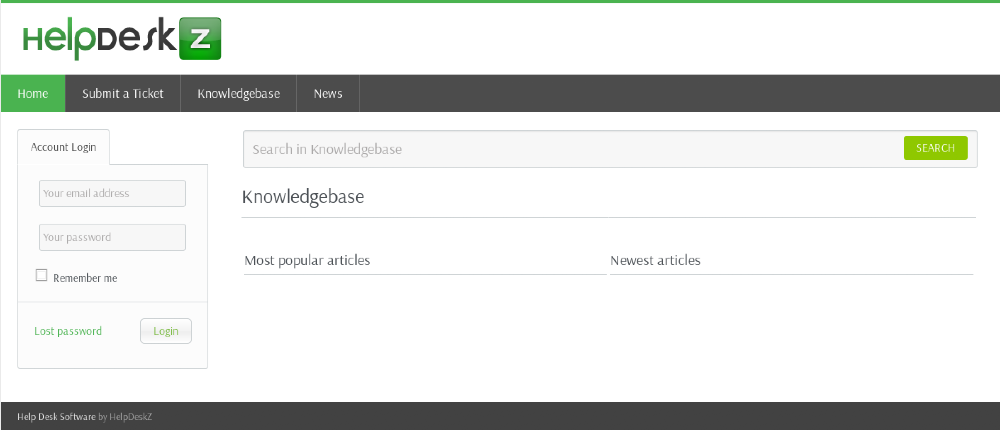

# Help

## User

### Scan
Starting with a scan: `nmap -sC -sV 10.10.10.117`:
```
Starting Nmap 7.70 ( https://nmap.org ) at 2019-03-29 21:37 EDT
Nmap scan report for 10.10.10.121
Host is up (0.18s latency).
Not shown: 997 closed ports
PORT     STATE SERVICE VERSION
22/tcp   open  ssh     OpenSSH 7.2p2 Ubuntu 4ubuntu2.6 (Ubuntu Linux; protocol 2.0)
| ssh-hostkey: 
|   2048 e5:bb:4d:9c:de:af:6b:bf:ba:8c:22:7a:d8:d7:43:28 (RSA)
|   256 d5:b0:10:50:74:86:a3:9f:c5:53:6f:3b:4a:24:61:19 (ECDSA)
|_  256 e2:1b:88:d3:76:21:d4:1e:38:15:4a:81:11:b7:99:07 (ED25519)
80/tcp   open  http    Apache httpd 2.4.18 ((Ubuntu))
|_http-server-header: Apache/2.4.18 (Ubuntu)
|_http-title: Apache2 Ubuntu Default Page: It works
3000/tcp open  http    Node.js Express framework
|_http-title: Site doesn't have a title (application/json; charset=utf-8).
Service Info: OS: Linux; CPE: cpe:/o:linux:linux_kernel

Service detection performed. Please report any incorrect results at https://nmap.org/submit/ .
Nmap done: 1 IP address (1 host up) scanned in 34.45 seconds
```
### Attempting Node.js
SSH looks standard, the webserver seems to just be the default page, but Node.js could be interesting. Navigating to `10.10.10.121:3000` in Firefox gives us our first clue.
```json
{"message":"Hi Shiv, To get access please find the credentials with given query"}
```
After trying many different REST API query strings, I determined that I needed to try other query languages. GraphQL is another common one, so I navigated to the GraphQL endpoint: `10.10.10.121:3000/graphql`. I made many attempts to query for the credentials but made no progress. 

### Exploiting HelpDeskZ
You might have better luck than I did with the query, but the message alone gives enough information to know that there is a login portal somewhere. `dirb` is a tool that we can use to scan the webserver and see if there are any more pages besides the default.

 

A support page that allows uploads is a very good sign because even though we don't have the credentials that the GraphQL query probably would have provided, we still may be able to get in through a PHP reverse shell. `10.10.10.121/support` gets us this page:



Search results for 'HelpDeskZ Exploit' show us that shell uploads are very common. I used [this link](https://packetstormsecurity.com/files/138548/HelpDeskz-1.0.2-Shell-Upload.html) to help develop the exploit. 

All we really need to do here is upload a PHP reverse shell using the 'Submit a Ticket' tab and then figure out the name and location of the upload. HelpDeskZ has their source available on Github [here](https://github.com/evolutionscript/HelpDeskZ-1.0). At the time of writing this, line 141 of `controllers/submit_ticket_controller.php` has the following:
```php
$filename = md5($_FILES['attachment']['name'].time()).".".$ext;
```
The uploaded filename is an md5 hash of our filename and the current time concatenated. So we'll write a script that will do the same thing in Python and then check the server for that file. 

The script I used can be found in `exploit/findurl.py`. Be sure to set your IP and port in the shell script before uploading and check that your system time is correct. If everything is aligned correctly and the script is run right after the file is uploaded, the URL of the file upload should be printedto the console a few seconds after the script is run. In my case, the server was about 5 minutes behind my system time and I had to modify the range in the python script accordingly. To find out exactly what time the server is using, use Burp to check the date on the response that is sent when you submit a support ticket.

Set up a `netcat` listener and specify the same port that was configured in the reverse shell script.
```
nc -vnlp 8080
```
Then navigate to the uploaded PHP script at `http:///10.10.10.121/support/uploads/tickets/enter_hash_here.php`. A low-level shell should now appear on the `netcat` lister and the we can navigate to `user.txt`:
```
bb8a7b36bdce0c61ccebaa173ef946af
```

## Root

## Privilege Escalation
The first thing we need to do is go through the usual enumeration steps when in a low privileged shell. Check permissions, go through logs, etc. After a bit of searching, I found that `/home/help/.bash_history has what looks like a password: `rOOTmEoRdIE`. We are also in many privileged groups like `adm`. If we're lucky, we might be able to just `su` right into root!

But of course it's never that easy. Typing `su` gives us the following:
```
su: must be run from a terminal
```
Getting around this is not difficult at all, but it did take me a while to realize that this was the right path to go down. Python can spawn terminals, so we can write a python script that I found [here](http://evertpot.com/189) and run it to get a terminal to be able to `su`.
```python
echo "import pty; pty.spawn('/bin/bash')" > /tmp/term.py
python /tmp/term.py
```
Now we have a much nicer shell! `su`, enter the password, and own root, right? Not so fast. It still doesn't work... Going back to the `.bash_history` it seems like the password wasn't actually working. I wonder if the user logging in was just making a common mistake: having Caps Lock on. `RootMeOrDie` is the non-caps version of `rOOTmEoRdIE`.  it seems like the password wasn't actually working. I wonder if the user logging in was just making a common mistake: having Caps Lock on. `RootMeOrDie` is the non-caps version of `rOOTmEoRdIE`. Now we can `su` to root, enter in the correct password, and own the system. `root.txt`:
```
b7fe6082dcdf0c1b1e02ab0d9daddb98
```
